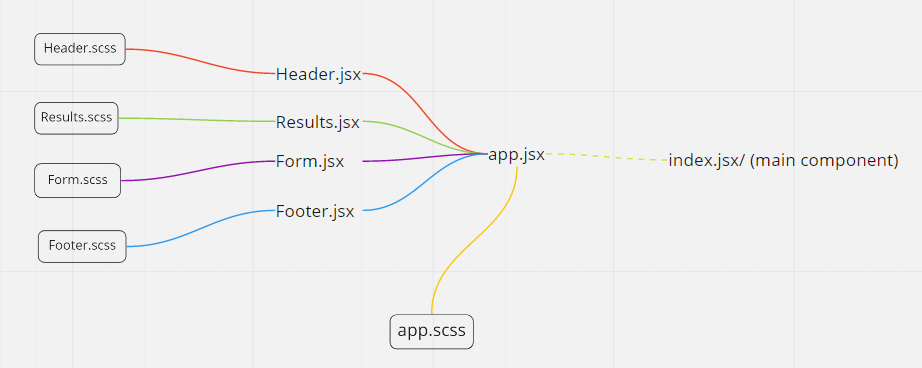

# LAB - Component Based UI

## Date: 8/8/2021
## Day: Sunday
 

---

 

## Live SandBox: https://mohammadaltamimi98.github.io/csb-71lnp/

## PR: https://github.com/MohammadAltamimi98/resty/pull/3

## How to use this application:
1. clone the repository in your terminal.
2. navigate your way to the directory.
3. install all dependecies ` npm i `
4. after installation run this command `nopm start` to start the application.

 
 

## UML

## lab27: Technical Requirements:

Technical Requirements / Note
It is not a requirement to make the actual API call. That can be mocked with “fake” data

Suggested Component Hierarchy and Application Architecture:

- index.js - Entry Point

- App.js - Container
Holds application state: The Request (from the form) and the Response (from the API)
A class method that can update state
Renders 2 Child Components

- `Form` Expects a function to be sent to it as a prop.

- Renders a URL entry form
A selection of REST methods to choose from (“get” should be the default)
The active selection should be displayed/styled differently than the others
- Renders a Textarea to allow the user to type in a JSON object for a POST or PUT request
On submit
- Send the Form entries back to the <App> using the method sent down in props
Form will run the API request
Toggle the “loading” status before and after the request.

## lab28: useEffect : - done
